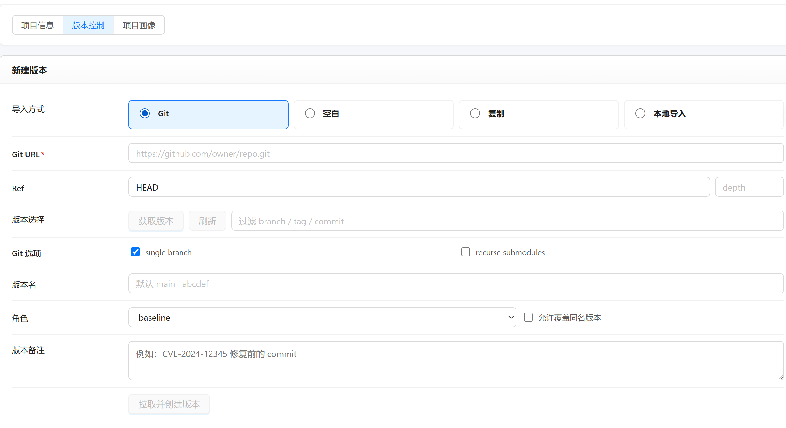
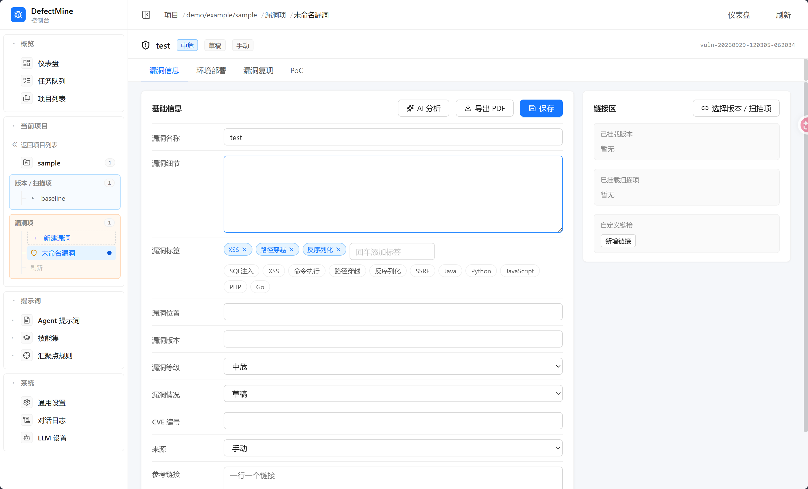
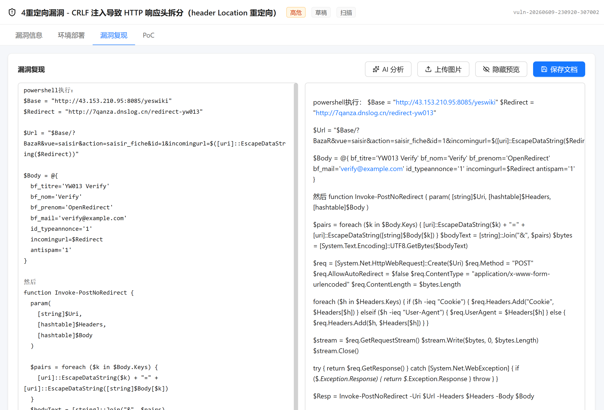
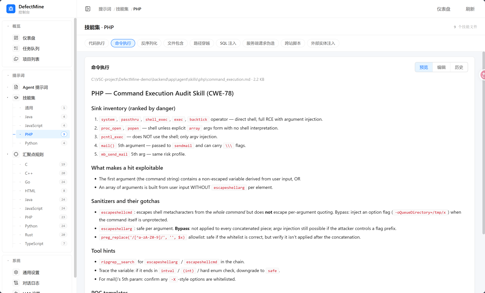
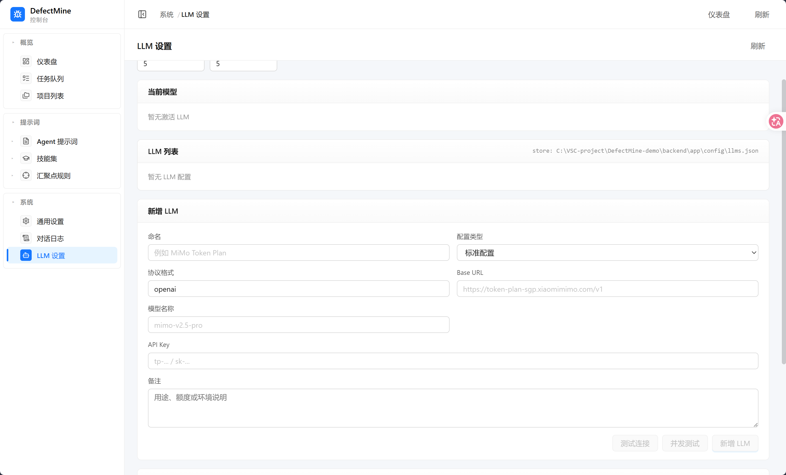

# DefectMine

DefectMine 是一个面向代码安全审计的 AI 辅助漏洞挖掘平台。它通过多个专用 Agent 协同分析项目目录、调用链、跨请求数据流和潜在漏洞，并提供一个本地 Web 控制台，用于管理项目、运行扫描、查看审计结果和维护规则。

## 核心能力

- **多 Agent 协同扫描**：TreeScan、CallScan、DataFlowScan 和 Auditor 分阶段完成代码审计。
- **项目与版本管理**：按来源、所有者、仓库和版本组织待审计代码。
- **全仓库与局部扫描**：支持完整项目扫描，也支持针对指定目录创建 specific run。
- **漏洞审计与复核**：查看漏洞详情、证据链、调用链、数据流和审计结论，并支持人工标注。
- **可配置的扫描知识库**：在控制台维护 Prompt、Skill 和 Sink 规则。
- **LLM 配置切换**：支持维护多个模型配置，按需要切换扫描模型和参数。
- **大文件分页浏览**：扫描产物、Markdown、JSONL、日志和对话记录按需加载，降低内存占用。
- **报告导出**：支持编写和导出漏洞复现报告。

## 控制台预览

### 扫描工作台


控制台提供项目列表、扫描流程、目录树、Agent 产物和审计结果等统一入口。

### 项目信息与版本




项目支持自定义名称、描述、标签、审计状态以及多个代码版本。

### 漏洞管理与报告





可以查看漏洞证据、关联扫描链，并整理复现步骤和修复建议。

### Skill、Sink 与 LLM 配置





规则和模型配置均可在控制台维护，便于针对不同项目调整扫描策略、效果和效率。

## 环境要求

- Python 3.10+
- Node.js 18+
- npm
- 可访问的 OpenAI 兼容或项目支持的 LLM 服务（运行实际 AI 扫描时需要）

## 安装与启动

### 后端

```bash
cd backend
python -m pip install -r requirements.txt
python -m uvicorn app.server.app:app --host 127.0.0.1 --port 8000 --reload
```

后端 API 文档：<http://127.0.0.1:8000/docs>

### 前端

新开一个终端：

```bash
cd frontend
npm install
npm run dev -- --host 127.0.0.1 --port 5173
```

前端地址：<http://127.0.0.1:5173>

Vite 会将 `/api` 请求代理到 `http://127.0.0.1:8000`。如果 5173 端口已被占用，请同步修改 `frontend/vite.config.ts` 中的后端代理地址，或使用一个单独的演示副本运行。

## 命令行 Agent

进入 `backend` 目录后，可以直接运行单个 Agent 或创建局部扫描上下文：

```bash
# 为某个版本的指定目录创建 specific run
python -m app.agent specific github/yeswiki/yeswiki/yeswiki-4.6.6 pages

# 运行单个 Agent
python -m app.agent treescan github/yeswiki/yeswiki/yeswiki-4.6.6
python -m app.agent callscan github/yeswiki/yeswiki/yeswiki-4.6.6
python -m app.agent dataflowscan github/yeswiki/yeswiki/yeswiki-4.6.6
python -m app.agent auditor github/yeswiki/yeswiki/yeswiki-4.6.6
```

扫描路径相对于仓库根目录下的 `repo/`，例如：

```text
github/yeswiki/yeswiki/yeswiki-4.6.6
└── repo/github/yeswiki/yeswiki/yeswiki-4.6.6
```

## 主要 API

| 方法 | 路径 | 作用 |
| --- | --- | --- |
| `GET` | `/api/health` | 服务健康检查 |
| `GET` | `/api/projects` | 列出项目、版本和扫描摘要 |
| `POST` | `/api/projects` | 创建项目 |
| `POST` | `/api/projects/{src}/{owner}/{repo}/versions` | 创建项目版本 |
| `GET` | `/api/projects/{src}/{owner}/{repo}/{version}/runs` | 查看版本的扫描记录 |
| `POST` | `/api/scans` | 创建扫描任务 |
| `POST` | `/api/scans/{scan_id}/start` | 启动扫描任务 |
| `GET` | `/api/artifacts/json` | 分页读取 JSON 产物 |
| `GET` | `/api/artifacts/audit` | 分页读取审计发现 |
| `GET` | `/api/events` | 读取运行事件和进度 |
| `GET` | `/api/conversations` | 查看 Agent 对话记录 |
| `GET` | `/api/llms` | 查看 LLM 配置 |

完整接口列表请访问启动后的 Swagger 文档：<http://127.0.0.1:8000/docs>。

## 数据目录

```text
repo/<source>/<owner>/<repo>/<version>/  # 待审计代码
└── .defectmine/                         # 扫描产物、运行状态和对话记录
backend/prompts/                         # Agent Prompt
backend/app/agent/skills/                # Skill 知识模块
backend/app/scanner/sink/                # Sink 规则
```

仓库代码、扫描产物、日志、报告和本地 LLM 配置默认不应提交到 Git；相关目录已在 `.gitignore` 中排除。

## 测试与构建

```bash
# 后端测试
cd backend
pytest -q

# 前端生产构建
cd frontend
npm run build
```

## 项目结构

```text
backend/
├── app/agent/        # Agent 编排与子 Agent
├── app/server/       # FastAPI API、扫描任务和数据服务
├── app/scanner/      # Sink 规则、切片和代码分析基础能力
├── prompts/          # Agent Prompt
├── scripts/          # 辅助脚本
└── tests/            # 后端测试

frontend/
├── src/components/   # 控制台页面组件
├── src/styles/       # 页面样式
└── src/api.ts        # 前端 API 客户端
```
