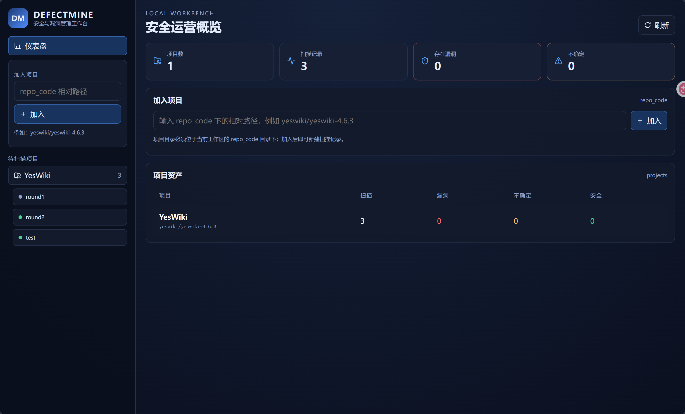
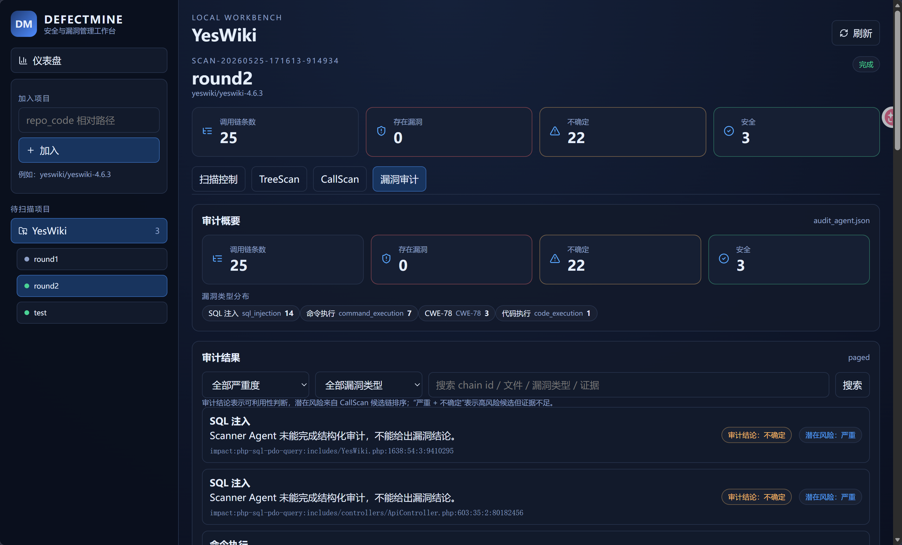

# DefectMine

DefectMine 是一个面向本地代码仓库的自动化安全审计 MVP。它以 `repo_code/` 下的项目为扫描对象，将流程拆成：

```text
TreeScan -> CallScan -> Scanner Audit
```

每个阶段都会把中间产物写入目标项目自己的 `.defectmine/` 目录，方便后续工作台、审计 Agent、复核 Agent、修复 Agent 继续复用上下文。

## 当前能力

- TreeScan：扫描项目目录和关键文件，生成项目画像、技术栈、风险面、focus paths。
- CallScan：读取 TreeScan 画像，加载 sink 规则库，使用本地 `rg.exe -u --json` 搜索危险函数，生成候选调用链和优先级队列。
- Scanner Audit：读取 `callscan_chains.priority.jsonl`，按调用链加载对应 Skill，调用 LLM 做结构化漏洞审计，并输出 JSON 和 Markdown 报告。
- Web 工作台：提供项目管理、扫描记录、扫描启动、TreeScan/CallScan/Audit 产物浏览和筛选。

## 环境准备

以下命令以 PowerShell 和项目根目录 `C:\VSC-project\DefectMine` 为例。

### 1. 创建 Python 虚拟环境

```powershell
cd C:\VSC-project\DefectMine
python -m venv .venv
.\.venv\Scripts\python.exe -m pip install -U pip
.\.venv\Scripts\python.exe -m pip install -r backend\requirement.txt
```

如果只安装根目录 `requirements.txt`，可能缺少 FastAPI、Rich、dotenv 等运行依赖，建议优先使用 `backend\requirement.txt`。

### 2. 配置 LLM

```powershell
Copy-Item backend\app\config\.env.example backend\app\config\.env
notepad backend\app\config\.env
```

`.env` 至少需要包含：

```env
LLM_BASEURL="https://your-llm-endpoint"
LLM_APIKEY="your-api-key"
LLM_MODEL="your-model-name"
LLM_PROVIDER="openai-compatible-provider"
```

### 3. 准备待扫描项目

将目标项目放入：

```text
repo_code/<项目路径>
```

例如：

```text
repo_code/yeswiki/yeswiki-4.6.3
```

CLI 中使用相对路径：

```powershell
yeswiki/yeswiki-4.6.3
```

### 4. 准备 ripgrep

CallScan 优先使用项目内的：

```text
ripgrep/rg.exe
```

也可以使用系统 PATH 中的 `rg`。推荐本地放置 `rg.exe`，保证工作台和 CLI 行为一致。

## CLI 使用

运行 CLI 前建议设置：

```powershell
$env:PYTHONPATH="backend"
```

### 全流程扫描

执行 TreeScan、CallScan、Scanner Audit：

```powershell
.\.venv\Scripts\python.exe backend\main.py yeswiki/yeswiki-4.6.3
```

限制 CallScan 输出的优先调用链数量和 Scanner 审计数量：

```powershell
.\.venv\Scripts\python.exe backend\main.py yeswiki/yeswiki-4.6.3 --priority-chain-limit 30 --audit-limit 30
```

只构建审计任务，不调用 LLM 审计：

```powershell
.\.venv\Scripts\python.exe backend\main.py yeswiki/yeswiki-4.6.3 --audit-dry-run --audit-limit 5
```

### 单独运行 CallScan

```powershell
.\.venv\Scripts\python.exe backend\main.py yeswiki/yeswiki-4.6.3 --callscan --priority-chain-limit 50 --show-sink-hits 15
```

### 单独运行 Scanner Audit

前提是项目下已经存在：

```text
.defectmine/callscan_chains.priority.jsonl
```

命令：

```powershell
.\.venv\Scripts\python.exe backend\main.py yeswiki/yeswiki-4.6.3 --audit --audit-limit 10
```

不启用本地工具循环：

```powershell
.\.venv\Scripts\python.exe backend\main.py yeswiki/yeswiki-4.6.3 --audit --audit-limit 10 --audit-no-tools
```

### 单独测试工作流模块

```powershell
$env:PYTHONPATH="backend"
.\.venv\Scripts\python.exe -c "from app.workflow import run_workflow; r=run_workflow('yeswiki/yeswiki-4.6.3', audit_limit=2, priority_chain_limit=2); print('项目路径:', r.project_absolute_path); print('产物目录:', r.artifacts_dir)"
```

## Web 工作台

### 启动 FastAPI 后端

```powershell
cd C:\VSC-project\DefectMine
.\.venv\Scripts\python.exe -m uvicorn app.api.server:app --host 127.0.0.1 --port 8000 --app-dir backend
```

如果提示 `WinError 10048`，说明 8000 端口已有后端进程。可以关闭旧进程，或换端口并同步修改前端代理。

### 启动前端

```powershell
cd C:\VSC-project\DefectMine\frontend
npm install
npm run dev
```

默认访问：

```text
http://127.0.0.1:5173
```



前端 `/api` 会代理到：

```text
http://127.0.0.1:8000
```

工作台不会重写扫描逻辑，启动扫描时仍复用 `backend/main.py`，保证 CLI 和 UI 产物一致。

## 中间产物

所有核心产物默认写入：

```text
repo_code/<项目路径>/.defectmine/
```

常见文件：

| 文件 | 来源 | 内容 |
| --- | --- | --- |
| `tree.json` | TreeScan | 压缩后的目录结构和文件元信息 |
| `treescan_agent.raw.txt` | TreeScan | TreeScan Agent 原始输出 |
| `treescan_agent.json` | TreeScan | 项目名称、功能、技术栈、风险面、扫描上下文 |
| `callscan_agent.json` | CallScan | sink 命中、调用链分析、ranked paths、summary |
| `callscan_chains.priority.jsonl` | CallScan | Scanner 的优先审计输入，每行一条候选调用链 |
| `audit_agent.json` | Scanner | 结构化审计结果 |
| `audit_findings.md` | Scanner | 中文 Markdown 审计报告 |
| `workflow_state.json` | Workflow | 全流程状态汇总 |
| `runs/<run_id>/console.log` | Workbench | 工作台启动扫描的运行日志 |

## JSON Schema 约定

`backend/app/prompts/` 是各 Agent 输出协议的来源。

当前 Scanner 审计结果以 `prompts/scanner.md` 为准：

```json
{
  "verdict": "vulnerable | uncertain | safe",
  "confidence": 0.0,
  "title": "中文标题",
  "cwe_guess": "CWE-89",
  "principle": "中文漏洞原理",
  "source": {"file": null, "line": null, "expr": null},
  "sink": {"file": "path/to/file.php", "line": 10, "expr": "query($sql)"},
  "data_flow": ["中文数据流说明"],
  "exploit_poc": "静态 PoC 描述，不执行",
  "fix_suggestion": "中文修复建议",
  "refuted_by": null,
  "missing_info": [],
  "evidence": [
    {"source": "audit_pack", "detail": "中文证据", "file": "path/to/file.php", "line": 10}
  ]
}
```

旧产物仍会被 API 尽量兼容读取：

- `not_vulnerable` -> `safe`
- `needs_review` / `inconclusive` -> `uncertain`
- `high` / `medium` / `low` 字符串置信度会映射为数值和 `confidence_label`

## 调试建议

### 后端语法检查

```powershell
.\.venv\Scripts\python.exe -m py_compile backend\app\scanner\audit_schema.py backend\app\scanner\scanner.py backend\app\api\server.py
```

### 前端构建检查

```powershell
cd frontend
npm run build
```

### 常见问题

#### `ModuleNotFoundError: No module named 'app'`

设置 `PYTHONPATH`：

```powershell
$env:PYTHONPATH="backend"
```

或使用 FastAPI 的 `--app-dir backend`。

#### `ModuleNotFoundError: No module named 'litellm'`

安装后端依赖：

```powershell
.\.venv\Scripts\python.exe -m pip install -r backend\requirement.txt
```

#### `could not pre-load sagemaker-runtime ... No module named 'botocore'`

这是 LiteLLM 的可选能力告警。已在依赖中加入 `botocore`，安装依赖后重启 FastAPI 后端即可。

#### 审计结果显示“不确定 + 严重”

- 审计结论：表示 Scanner 是否确认可利用。
- 潜在风险：来自 CallScan 候选链和 sink 规则的风险等级。

“严重 + 不确定”表示高风险候选链证据不足，需要更多上下文或人工复核。

